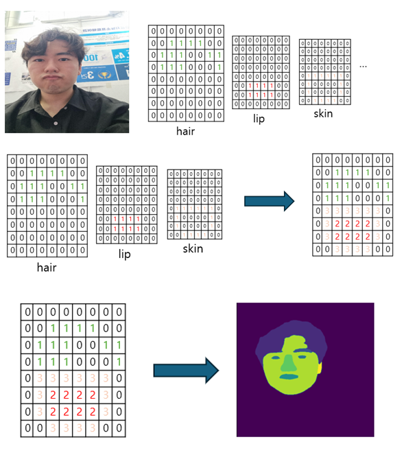
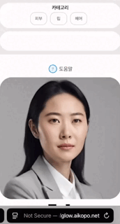

#  Project RealGlow 

## 1. 프로젝트 소개

생필품, 가전제품 등은 온라인으로 구매하는데 화장품을 온라인으로 살 순 없을까? 라는 물음에서 시작된 우리의 프로젝트는 
RealGlow 어플리케이션을 이용해 소비자들은 제품의 실제 효과를 시각적으로 확인하고 온라인상에서도 자신에게 가장 적합한 제품을 선택해 구매 링크를 제공하는 쇼핑 도우미 프로젝트 입니다.

[사용 방법](#7-웹-서비스)

## 2. 팀원 소개 

| 이름     | 소속                                | 역할                  | 기술 스택                                                                                                                                                             | 
|:---------|:-------------------------------------|:---------------------|:---------------------------------------------------------------------------------------------------------------------------------------------------------------------| 
| 강병준   | 한국 폴리텍 대학   서울정수캠퍼스   인공지능소프트웨어과   교수 | 지도교수             |                                                                                                                                                                    | 
| 조원우   | HD한국조선해양   | 멘토             |                                                                                                                                                                    | 
| 유승호   | 한국 폴리텍 대학   서울정수캠퍼스   인공지능소프트웨어과   2학년 | 멘티 팀장   세그멘테이션 모델 개발   세그멘테이션 모델학습  세그멘테이션 인터페이스 개발    OpenCV기반 합성 알고리즘 작성   서버 아키텍쳐 설계  인공지능 백엔드 서버 구축       RestAPI 설계   React를 이용한 프론트 엔드구축   웹 서버 구축   컴퓨터 시연용 GUI 개발 |                   | 
| 박명연   | 한국 폴리텍 대학   서울정수캠퍼스   인공지능소프트웨어과   2학년 | 멘티  프론트엔드 앱 개발  | | 
| 이은송   | 한국 폴리텍 대학   서울정수캠퍼스   인공지능소프트웨어과   2학년 | 멘티  프론트엔드 앱 개발  |  | 

## 3. 개요
- **프로젝트 이름**: RealGlow 
- **프로젝트 개발 기간**: 2024.04.01 ~ 2024.10.22
- **클라우드 서버**: 
- **OS**: 
- **개발 언어**:   
- **개발 프레임워크**:    
- **데이터 베이스**:  

- **서버**:  
 
## 4. 서버 아키텍쳐 설계
 

## 5. 구현 일정
### 1 차시
| 구분   | 추진 내용                                          | 1주 | 2주 | 3주 | 4주 | 5주 | 6주 | 7주 | 8주 | 9주 | 10주 | 11주 | 12주 | 13주 | 14주 | 15주 | 16주 |
|--------|----------------------------------|-----|-----|-----|-----|-----|-----|-----|-----|-----|-----|-----|-----|-----|-----|-----|-----|
| 팀 구성   | 팀 구성 |                                 ■  |   |     |     |     |     |     |     |     |     |     |     |     |     |     |     |
| 주제선정   | 주제선정       |                                   |■   |     |     |     |     |     |     |     |     |     |     |     |     |     |     |
| 기획   | 요구사항 분석 및 UML 도출 |                                   | ■  |  ■   |   ■  |     |     |     |     |     |     |     |     |     |     |     |     |
| 기술분석   | 관련기술 분석 |                                   |   |     |  ■   |  ■   |     |     |     |     |     |     |     |     |     |     |     |
| 1차 발표   | 1차 발표 |                                   |   |     |     |     |     |   ■  |  ■   |     |     |     |     |     |     |     |     |
| 모델 개발 | 웹 호스팅 및 디버깅         |                                   |   |     |     |    U I  | 제    | 작    |     |     | 앱    | 개발    |  및   |  모델   |  포팅   |     |     |
| 2차 발표 | 2차 발표         |                                   |   |     |     |     |     |     |     |     |     |     |     |     |     |  2차   |  발표   |

### 2 차시
| 구분   | 추진 내용                      | 1주 | 2주 | 3주 | 4주 | 5주 | 6주 | 7주 | 8주 |9주 |10주 |11주 |
|--------|-------------------------------|-----|-----|-----|-----|-----|-----|-----|-----|-----|-----|-----|
| 앱 개발   | 앱 개발 및 모델 포팅 |            ■ | ■  |   ■ |     |     |     |     |     |     |
| 모델 개선   | 모델 개선      |    ■ | ■   | ■   |  ■   |   |     |     |     |     |
| 서버 구축   | AWS를 이용한 Flask 서버구축 |                         |     |     |    | ■   |   ■  |  ■   |     |     |
| 테스트   | 단위 테스트, 통합 테스트 |                              |     |     |    |    |     |  단위   테스트   |   통합   테스트   |    |
| 발표 | 최종 발표        |                                  |     |     |     |     |    |    |    |    |   | ■ |

## 6. 구현 핵심 기술
### AI 서버
- Instance Segmentation   Bisnet 를 통한 Segmentation 을 통해 얼굴을 인식하고 얼굴 부위 분할을 통해 세그멘테이션 맵 추출

- Image Processing 
이미지의 비트연산을 이용해 MASK를 추출 알파 블렌딩을 이용해 자연스럽게 색을 적용해 합성하는 알고리즘을 적용

### 프론트 웹
- Ajax 기반의 비동기 통신 Ajax를 활용한 비동기 호출을 통해 CSR(Client-Side Rendering) 방식의 데이터 렌더링을 구현. 서버 요청 시 페이지 리로드 없이 필요한 데이터만 갱신하여 사용자   경험(UX)을 향상시킴.

- React와 상태 관리  
React의 컴포넌트 기반 구조를 사용해 UI를 효율적으로 관리, 데이터 흐름을 일관성 있게 유지함.

- 반응형 웹 디자인  
Media querie를 이용해 모바일과 컴퓨터의 반응형 디자인 구현

- heic2any를 통한 이미지 호환 
모바일에서 많이사용하는 이미지 형식인 HEIC/HEIF의 처리를 위해 heic2any를 사용, 모바일 기기에서의 이미지 호환성을 높임

- browser-image-compression를 통한 이미지 압축 
고화질 이미지는 5MB가 넘는 일이 많으며, 서버의 부담을 키울 수 있어 browser-image-compression를 이용해 이미지를 압축해 서버에 부담을 최소화함.

### 안드로이드 프론트 앱

## 7. 웹 서비스
우리가 만든 웹 서비스를 직접 체험해 보세요!

[데모 사이트 방문하기](http://realglow.aikopo.net/)

[사용방법]

## 8. 업데이트 내역
- 09.24
    1. 프론트 웹 어플리케이션에 git action 추가, CI/CD 구축 성공

- 09.25
    1. 도메인 주소 추가
    2. 서버 이전
    3. 프론트 페이지 작성 완료
    4. browser-image-compression 라이브러리를 통해 이미지 압축 구현

## 9. Reference
- 추후 작성 예정
